<!-- ========================= PORTADA ========================= -->

  

  

  Desarrollo sistemas empresariales, servicios backend, APIs, automatizaciones 
  e integraciones orientadas a resolver necesidades reales.

  
  
  
  

  <strong>Java · Spring Boot · PHP · C#/.NET · JavaScript · SQL</strong>

---

<!-- ========================= SOBRE MÍ ========================= -->

## 👨‍💻 Sobre mí

Soy desarrollador de software enfocado en construir **soluciones empresariales, aplicaciones web, servicios backend, APIs e integraciones entre sistemas**.

He trabajado en proyectos que abarcan desde el diseño de bases de datos y la implementación de lógica de negocio, hasta interfaces administrativas, automatización de procesos, transferencia de archivos y despliegue de servicios contenerizados.

También desarrollo de manera independiente **Conexión Creativa**, una iniciativa orientada a la creación de soluciones tecnológicas y software adaptado a necesidades reales.

> 🔐 Parte de mi experiencia corresponde a proyectos privados que no pueden publicarse por motivos de confidencialidad. Los proyectos demostrativos de este perfil utilizarán datos, credenciales y escenarios ficticios.

---

<!-- ========================= ÁREAS ========================= -->

## 🚀 Áreas de desarrollo

<table>
  <tr>
    <td width="50%" valign="top"><strong>🏢 Sistemas empresariales</strong> ERP, administración, operaciones, finanzas, recursos humanos y procesos internos.</td>
    <td width="50%" valign="top"><strong>⚙️ Backend</strong> Lógica de negocio, servicios, APIs REST y microservicios.</td>
  </tr>
  <tr>
    <td width="50%" valign="top"><strong>🌐 Aplicaciones web</strong> Interfaces responsivas, paneles administrativos y módulos operativos.</td>
    <td width="50%" valign="top"><strong>🔗 Integraciones</strong> SFTP, Amazon S3, servicios externos y comunicación entre sistemas.</td>
  </tr>
  <tr>
    <td width="50%" valign="top"><strong>🤖 Automatización</strong> Procesamiento de archivos, tareas programadas y flujos operativos.</td>
    <td width="50%" valign="top"><strong>🖥️ Aplicaciones de escritorio</strong> Herramientas y agentes para Windows con C# y WPF.</td>
  </tr>
  <tr>
    <td width="50%" valign="top"><strong>🗄️ Bases de datos</strong> Modelado, consultas, procedimientos, reportes y optimización.</td>
    <td width="50%" valign="top"><strong>📦 Infraestructura</strong> Contenedores, configuración de servicios y despliegues.</td>
  </tr>
</table>

---

<!-- ========================= TECNOLOGÍAS ========================= -->

## 🛠️ Tecnologías utilizadas en proyectos

<table align="center">
  <tr>
    <td align="center" width="135">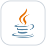 <strong>Java</strong></td>
    <td align="center" width="135"> <strong>Spring Boot</strong></td>
    <td align="center" width="135"> <strong>PHP</strong></td>
    <td align="center" width="135">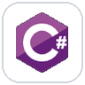 <strong>C#</strong></td>
  </tr>
  <tr>
    <td align="center" width="135">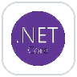 <strong>.NET</strong></td>
    <td align="center" width="135"> <strong>JavaScript</strong></td>
    <td align="center" width="135"> <strong>Maven</strong></td>
    <td align="center" width="135">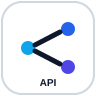 <strong>REST APIs</strong></td>
  </tr>
</table>

 

<table align="center">
  <tr>
    <td align="center" width="135"> <strong>JavaScript</strong></td>
    <td align="center" width="135"> <strong>HTML5</strong></td>
    <td align="center" width="135">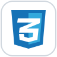 <strong>CSS3</strong></td>
    <td align="center" width="135">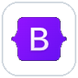 <strong>Bootstrap</strong></td>
    <td align="center" width="135"> <strong>jQuery</strong></td>
  </tr>
</table>

AdminLTE · DataTables · Select2 · SweetAlert2

 

<table align="center">
  <tr>
    <td align="center" width="160"> <strong>MySQL</strong></td>
    <td align="center" width="160">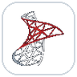 <strong>SQL Server</strong></td>
    <td align="center" width="160"> <strong>Oracle</strong></td>
  </tr>
</table>

<strong>SQL · Consultas y modelado · Procedimientos almacenados · Reportes y optimización</strong>

 

<table align="center">
  <tr>
    <td align="center" width="145"> <strong>REST APIs</strong></td>
    <td align="center" width="145"> <strong>JSON</strong></td>
    <td align="center" width="145"> <strong>SFTP</strong></td>
    <td align="center" width="145"> <strong>Telegram API</strong></td>
    <td align="center" width="145">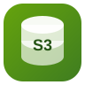 <strong>Amazon S3</strong></td>
  </tr>
</table>

 

<table align="center">
  <tr>
    <td align="center" width="165"> <strong>Amazon S3</strong></td>
    <td align="center" width="165"> <strong>Secrets Manager</strong></td>
    <td align="center" width="165"> <strong>Amazon ECS</strong></td>
    <td align="center" width="165"> <strong>AWS Fargate</strong></td>
  </tr>
</table>

 

<table align="center">
  <tr>
    <td align="center" width="135">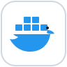 <strong>Docker</strong></td>
    <td align="center" width="135">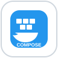 <strong>Compose</strong></td>
    <td align="center" width="135">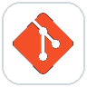 <strong>Git</strong></td>
    <td align="center" width="135">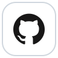 <strong>GitHub</strong></td>
  </tr>
  <tr>
    <td align="center" width="135"> <strong>Maven</strong></td>
    <td align="center" width="135"> <strong>Postman</strong></td>
    <td align="center" width="135"> <strong>Plesk</strong></td>
    <td align="center" width="135">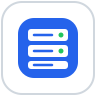 <strong>Hosting</strong> Configuración y despliegue</td>
  </tr>
</table>

 

<table align="center">
  <tr>
    <td align="center" width="170"> <strong>C#</strong></td>
    <td align="center" width="170"> <strong>.NET</strong></td>
    <td align="center" width="170"> <strong>WPF / Windows</strong></td>
  </tr>
</table>

<strong>C# · .NET · WPF · MVVM · Servicios y agentes para Windows</strong>

  
<strong>🧩 Ver librerías y componentes complementarios</strong>

   
  <table>
    <tr><td>AdminLTE</td><td>DataTables</td><td>Select2</td></tr>
    <tr><td>SweetAlert2</td><td>Chart.js</td><td>Flatpickr</td></tr>
    <tr><td>FullCalendar</td><td>Bootstrap</td><td>jQuery</td></tr>
    <tr><td>PDO</td><td>RestTemplate</td><td></td></tr>
  </table>

---

<!-- ========================= RECURSOS PÚBLICOS ========================= -->

## 📌 Próximos recursos públicos

Estoy preparando **proyectos demostrativos, diseños reutilizables, componentes y snippets** basados en experiencias y problemas reales de desarrollo. Todo el contenido utilizará información completamente ficticia y estará separado del código de proyectos privados.

### 🧱 Proyectos demostrativos

| Recurso | Estado |
|---|:---:|
| Arquitectura modular para sistemas empresariales con PHP |  |
| API REST con Java y Spring Boot |  |
| Transferencias de archivos entre SFTP y Amazon S3 |  |
| Aplicación empresarial con C# y WPF |  |
| Dashboard administrativo responsivo |  |
| Ejercicios y buenas prácticas de SQL |  |

### 🎨 Diseños y componentes reutilizables

| Recurso | Estado |
|---|:---:|
| Diseños de login responsivos y reutilizables |  |
| Plantillas para paneles administrativos |  |
| Componentes para formularios, filtros y búsquedas |  |
| Tablas, paginadores, modales y dashboards |  |
| Layouts responsivos para web, tablet y móvil |  |

### ✂️ Snippets y ejemplos técnicos

| Recurso | Estado |
|---|:---:|
| Consultas, procedimientos y optimización SQL |  |
| Ejemplos de Java y Spring Boot |  |
| Fragmentos reutilizables con PHP y PDO |  |
| Utilidades JavaScript para interfaces web |  |
| Configuraciones de Docker y propiedades de servicios |  |

---

<!-- ========================= APRENDIZAJE ========================= -->

## 🌱 Actualmente fortaleciendo

Actualmente estoy ampliando mis conocimientos en desarrollo frontend moderno
mediante proyectos de práctica, prototipos y componentes reutilizables.

  
  
  
  

> Estas tecnologías se encuentran en proceso de consolidación y todavía no forman parte de mi experiencia productiva principal.

---

<!-- ========================= TRABAJO ACTUAL ========================= -->

## 🧭 En qué estoy trabajando

- [x] Mejorando arquitecturas backend y servicios con Spring Boot
- [x] Desarrollando soluciones empresariales modulares
- [x] Automatizando transferencias y procesamiento de archivos
- [x] Fortaleciendo prácticas de seguridad y configuración
- [x] Preparando proyectos públicos para compartir conocimientos
- [x] Desarrollando iniciativas independientes mediante Conexión Creativa

---

<!-- ========================= PORTAFOLIO ========================= -->

## 🌐 Portafolio

Mi portafolio personal estará disponible próximamente en:

  

---

<!-- ========================= CONTACTO ========================= -->

## 📫 Contacto

Para colaboraciones profesionales, proyectos independientes o intercambio técnico, puedes utilizar los enlaces sociales disponibles en mi perfil de GitHub.

<strong>Building software that connects ideas, processes and people.</strong>

<strong>StackByCarlos</strong>

  

